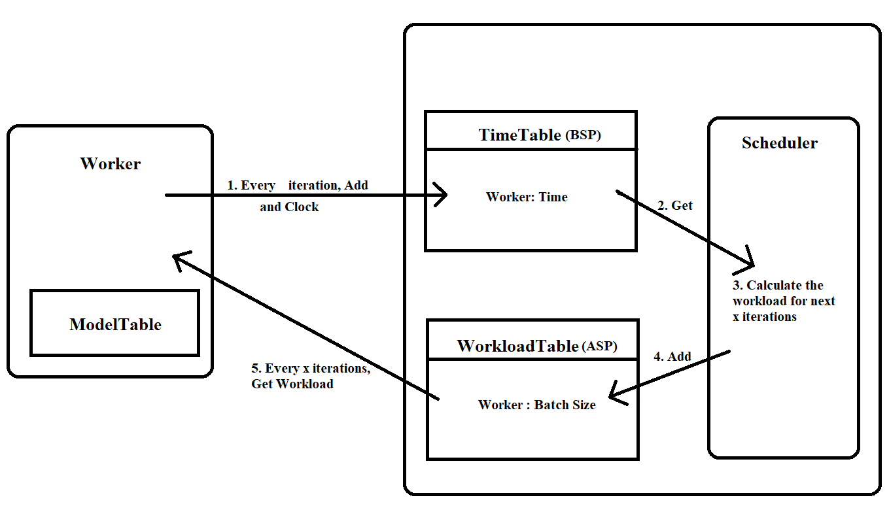

# CSCI5570 Course Project Report

## 1. Baseline Features

### Functionality of workers (20%)

#### Model Accessing (10%)
[KVClientTable](worker/kv_client_table.hpp) provides a user interface to access the model parameters on the worker side, and issues push/pull requests.

Implemented `MapStorage` and `VectorStorage` and both support sparse and dense models.

#### Training Data Abstraction (5%)

`AbstractDataLoader` and `AbstractAsyncDataLoader` provide a user interface to access the training/testing data (loaded from distributed file systems HDFS)
Implemented `lib/labeled_sample.hpp` with `Eigen::Vector` and `Eigen::SparseVector` for the training data abstraction.

`lib/labeled_sample.hpp`

    template <typename Feature, typename Label>
    class LabeledSample : public AbstractSample<Feature,Label> {
        public:
            Eigen::SparseVector<Feature> features;
            Label label;

            LabeledSample(int n_features = 0) {
              if (n_features > 0)
                features.conservativeResize(n_features+1);
            }

            void addFeature(int index, Feature feature) override
            {
                features.coeffRef(index) = feature;
            }
            void addLabel(Label label) override
            {
                this->label = label;
            }

    };  // class LabeledSample

<!-- FIXME: We implemented in Abstract Interface, definitely it is a NONO. -->

Implemented DataLoader and AsyncDataLoader for loading the data.

for the Async Data Loader, we have used multi-producer, multi-consumer lock-free queue implemented my ModdyCamel.
<http://moodycamel.com/blog/2014/a-fast-general-purpose-lock-free-queue-for-c++>. Imported in `lib/concurrentqueue.h` and `blockingconcurrentqueue.h`

#### Application Logic Execution (5%)

`MLTask` provide the interface to set the user defined function and `Engine->Run()` provides a user interface to execute user defined function

### Functionality of servers (30%)

#### Request handling (5%)
The `Mailbox` is implemented as a bottom layer communication module, see `comm/mainbox.cpp`, `comm/sender.cpp`.
`ServerThreads`, `WorkerThreads` implemented to handles push/pull requests from server/workers, see `server/server_thread.cpp` and `worker/worker_thread.cpp`

#### Model manipulation (10%)

`AbstractPartitionManager` maintains a partition of model parameters.

`ConsistentHashingPartitionManager` implemented using Jump Consistent Hash.
Jump consistent hash is a fast, minimal memory, consistent hash algorithm developed by Google <https://arxiv.org/ftp/arxiv/papers/1406/1406.2294.pdf>.
Implemented in `base/consistent_hashing_parition_manager.hpp`

    // Jump Consistent Hash : https://arxiv.org/ftp/arxiv/papers/1406/1406.2294.pdf
    static int32_t JumpConsistentHash(uint64_t key, int32_t num_buckets) {
        int64_t b = -1, j = 0;
        while (j < num_buckets) {
            b = j;
            key = key * 2862933555777941757ULL + 1;
            j = (b + 1) * (double(1LL << 31) / double((key >> 33) + 1));
        }
        return b;
    }

`RangePartitionManager` also implemented using range based partitioning, implemented in `base/range_partition_manager.hpp`

provides access and applies updates to the parameters.

#### Consistency control (15%): 5% for each consistency model

supported three consistency models (`BSPModel`, `SSPModel` and `ASPModel`), Implemented in `server/consistency/bsp_model.hpp`, `server/consistency/asp_model.hpp` and `server/consistency/ssp_model.hpp` respectively.

<!-- FYI: Completeness and robustness (10%): the program has no obvious bug and can run the correct logic -->

## 2. Addition Features - Addressing straggler problems

We have chosen to add a feature to mitigate straggler problem.

### Workload Scheduler using iteration time feedback from worker

The aim of Scheduler is to solve the Straggler among workers. The worker thread will record the time used by each worker for an iteration and a scheduler (one of the worker thread will be assigned) will use this to calculate the workload of each worker in the following iteration. The worker thread will get the workload suggested by scheduler and execute the workload.

2 addition tables in engine is created for this purpose. `TimeTable` and `WorkloadTable`.

The Engine will create and Initialize `TimeTable` and `WorkloadTable` when `engine->Run()` is called.

The Scheduler will be implemented by application UDF using `task.SetScheduler()`, similar to `task.SetLambda()`.

### Injected Straggler Model

We support random straggler delay in application, for example, in `logistic_regression.cpp`, we add

    DEFINE_double(with_injected_straggler_delay_percent, 100, "injected straggler delay in %");
    DEFINE_bool(activate_transient_straggler, true, "activate transient straggler");
    DEFINE_bool(activate_permanent_straggler, true, "activate permanemt straggler");

`with_injected_straggler_delay_percent` is the setting to inject straggler delay to the actual execution time of the iteration. for example, the actual iteration time is 1s, then the 100% delay will incur 1s sleep before Add/Clock

`activate_transient_straggler` is to activate the injection of transisent straggler. The transisent straggler is now designed to inject delay to worker ID == 1 and iteration count from 50 to 75. 

    if (FLAGS_activate_transient_straggler && info.worker_id == 1 && i >= 50 && i < 75)

`activate_permanent_straggler` is to activate the injection of permanet straggler. The permanent straggler is now designed to inject delay to worker ID == 3 and to all iteration. 

    if (FLAGS_activate_permanent_straggler && info.worker_id == 3)

### Benchmark Utility
We implemented benchmark utility so that we can measure the actual time lapsed for some part of the code.
implemented in `lib/benchmark.hpp`

It is designed to collecting datapoint for benchmark and instrument the execution time for statistic or straggler delay calculation. 

It provide the call to `start_measure`, `stop_measure`, `pause_measure` and `resume_measure` for collecting one data point. Whenever calling a `start_measure`, it will start a new data point and util `stop_measure`, it will record a data point. With all the datapoint is stored in Benchmark object, it provide a `mean`, `std_dev`, `sum` or `total` for all data point, also you can retrieve last n datapoint recorded through `last(n)` function. 

It also provide the utility call to inject a lambda function and calculate the time lapsed. more please see the `lib/benchmark_test.cpp` for its functionalities and testing. 

### Reporting interface

We use GLOG with prefix [STAT_TYPE] to allow worker/server to report the time, and gathered into CSV format.
e.g. `VLOG(2) << "[STAT_TIME] " `

Currently we use a runner script to extract the running statistic. `scripts/logistic_regression.py`, `scripts/svm.py`, `scripts/mf.py` will launch the application in cluster through SSH, and it will collect all the log into a shared folder (default to logs/[timestamp]). When the app is completed, the script will select the statistic log and distribute to CSV with corresponding file. e.g. stat_time, stat_work, stat_iter.. 

    print "Preparing statistic file"
    for type in ['wait' , 'proc', 'iter', 'work', 'time', 'totl'] :
        os.system("grep STAT_" + type.upper() + " " + log_dir + "/output.* | awk '{print $5 \",\" $6}' > " + log_dir + "/stat_" + type + ".csv")

After generating the stat file, it has a function to email the stat file to the user. :)

    email=os.getlogin() + "@link.cuhk.edu.hk"
    print "Email result? [yes or no]"
    yes = {'yes','y', 'ye', ''}
    no = {'no','n'}
    #choice = raw_input().lower()
    choice = "yes"
    while True :
        if choice in yes :
            print "Sending Email to [" + email + "]"
            os.system("mail -s 'Result for" + log_dir + "' -a " + log_dir + "/stat_iter.csv   -a " + log_dir + "/stat_proc.csv   -a " + log_dir +      "/stat_time.csv   -a " + log_dir + "/stat_wait.csv   -a " + log_dir + "/stat_work.csv  "+email+" < /dev/null")
            break
        elif choice in no:
            break
        else:
          print "Please respond with 'yes' or 'no'"
    print "Finished"

## 3. Application

Basically we are porting the other implementation (majorly python) and implement into our parameter server impelementation. 

### Logistic Regression

The implementation is based on the SGD approach, basically porting the python implementation to our implementation <https://machinelearningmastery.com/implement-logistic-regression-stochastic-gradient-descent-scratch-python/> 
Execute from `scripts/logistic_regression.py`

### Support Vector Machine

The SVM implementation is also based on the python implementation here: 
<https://maviccprp.github.io/a-support-vector-machine-in-just-a-few-lines-of-python-code/>
Execute from `scripts/svm.py`
### Matrix Factorization

The Matrix Factorization implementation is also based on the python implementation here: 
<http://www.albertauyeung.com/post/python-matrix-factorization/>
Execute from `scripts/mf.py`

## 4. Conclusion

### Final Design
<!-- TODO: Anything we need to address here instead of baseline -->

### Technical Challenges
We have designed a scheduling algorithm for the scheduler.

    double min_time = *std::min_element(times.begin(), times.end());
    int workload_buffer = 0, count = 0;

    std::multimap<double, uint32_t> time2thread;
    std::map<uint32_t, int> thread2index;

    for (int j = 0; j < info.thread_ids.size(); j++)
    {
        if (times[j] > min_time * update_threshold)
        {
            workload_buffer += round(workloads[j] * rebalance_workload);
            workloads[j] = round(workloads[j] * (1 - rebalance_workload));
        }
        else count += 1;

        time2thread.insert(std::make_pair(times[j], info.thread_ids[j]));
        thread2index.insert(std::make_pair(info.thread_ids[j], j));
    }

    for (auto pair : time2thread)
    {
        workloads.at(thread2index.at(pair.second)) += round(workload_buffer / double(count));
        workload_buffer -= round(workload_buffer / double(count));
        count -= 1;
        if (workload_buffer < 1) break;
    }

    info.workloadTable->Add(info.thread_ids, workloads);

The algorithm works as follow,
1. Find the smallest processing time as min_time.
2. Find the workers that have processing time larger than min_time * update_threshold (we set this to 1.5).
3. Take away some workloads from these workers, the number of workloads taking away is calculated by current workload * rebalance_workload (we set this to 0.2). Since number of workloads must be integer, we round the result.
4. Distribute these workloads to the remaining workers in ascending order of their processing time, try to distribute evenly while make sure that the total workloads is unchanged.

This algorithm can handle both permanent and transient stragglers. This is because when a permanent or transient straggler is found, its workloads will be reduced by the algorithm. It also works when the transient straggler is recovered, because the recovered worker will have the smallest processing time and caused others to be treated as stragglers. Therefore, the algorithm will give back some workloads to this worker.

### Evaluation on the performance

#### KDD12 Logistic Regression, 10 iterations

Iteration : 10
Batch Size : 100

Average Data Loading time : 80s. 

    output.0.log:I1222 02:37:16.931885 117845 logistic_regression.cpp:279] Worker 3 load time 93499 ms
    output.0.log:I1222 02:37:17.523623 117843 logistic_regression.cpp:279] Worker 1 load time 94091.5 ms
    output.0.log:I1222 02:37:18.040526 117847 logistic_regression.cpp:279] Worker 4 load time 94607.3 ms
    output.0.log:I1222 02:37:20.087000 117844 logistic_regression.cpp:279] Worker 2 load time 96654.8 ms
    output.1.log:I1222 02:37:12.184015 117409 logistic_regression.cpp:279] Worker 8 load time 88750.8 ms
    output.1.log:I1222 02:37:12.378906 117407 logistic_regression.cpp:279] Worker 6 load time 88946.8 ms
    output.1.log:I1222 02:37:12.521369 117408 logistic_regression.cpp:279] Worker 7 load time 89089.2 ms
    output.1.log:I1222 02:37:12.564000 117411 logistic_regression.cpp:279] Worker 9 load time 89129.5 ms
    output.1.log:I1222 02:37:12.585086 117406 logistic_regression.cpp:279] Worker 5 load time 89153.1 ms
    output.2.log:I1222 02:37:12.317158 17870 logistic_regression.cpp:279] Worker 13 load time 88882.8 ms
    output.2.log:I1222 02:37:12.400319 17868 logistic_regression.cpp:279] Worker 11 load time 88968.2 ms
    output.2.log:I1222 02:37:12.419085 17872 logistic_regression.cpp:279] Worker 14 load time 88984.3 ms
    output.2.log:I1222 02:37:19.007053 17869 logistic_regression.cpp:279] Worker 12 load time 95574.9 ms
    output.2.log:I1222 02:37:19.580077 17867 logistic_regression.cpp:279] Worker 10 load time 96148.1 ms
    output.3.log:I1222 02:37:12.183238 60334 logistic_regression.cpp:279] Worker 17 load time 88751 ms
    output.3.log:I1222 02:37:12.200084 60337 logistic_regression.cpp:279] Worker 19 load time 88765.6 ms
    output.3.log:I1222 02:37:12.360842 60335 logistic_regression.cpp:279] Worker 18 load time 88926.4 ms
    output.3.log:I1222 02:37:12.558207 60333 logistic_regression.cpp:279] Worker 16 load time 89126.1 ms
    output.3.log:I1222 02:37:12.584966 60332 logistic_regression.cpp:279] Worker 15 load time 89152.9 ms

Average Sample per Worker: 8 Million sample

    output.0.log:I1222 02:37:16.932014 117845 logistic_regression.cpp:281] Worker 3 got 8433699 samples
    output.0.log:I1222 02:37:17.523679 117843 logistic_regression.cpp:281] Worker 1 got 8439524 samples
    output.0.log:I1222 02:37:18.040565 117847 logistic_regression.cpp:281] Worker 4 got 8435698 samples
    output.0.log:I1222 02:37:20.087049 117844 logistic_regression.cpp:281] Worker 2 got 8399069 samples
    output.1.log:I1222 02:37:12.184139 117409 logistic_regression.cpp:281] Worker 8 got 8311476 samples
    output.1.log:I1222 02:37:12.378942 117407 logistic_regression.cpp:281] Worker 6 got 8043410 samples
    output.1.log:I1222 02:37:12.521420 117408 logistic_regression.cpp:281] Worker 7 got 7867438 samples
    output.1.log:I1222 02:37:12.564056 117411 logistic_regression.cpp:281] Worker 9 got 7757567 samples
    output.1.log:I1222 02:37:12.585137 117406 logistic_regression.cpp:281] Worker 5 got 8208962 samples
    output.2.log:I1222 02:37:12.317250 17870 logistic_regression.cpp:281] Worker 13 got 8095891 samples
    output.2.log:I1222 02:37:12.400389 17868 logistic_regression.cpp:281] Worker 11 got 7819678 samples
    output.2.log:I1222 02:37:12.419123 17872 logistic_regression.cpp:281] Worker 14 got 8206091 samples
    output.2.log:I1222 02:37:19.007103 17869 logistic_regression.cpp:281] Worker 12 got 8434659 samples
    output.2.log:I1222 02:37:19.580134 17867 logistic_regression.cpp:281] Worker 10 got 8433006 samples
    output.3.log:I1222 02:37:12.183383 60334 logistic_regression.cpp:281] Worker 17 got 7203196 samples
    output.3.log:I1222 02:37:12.200134 60337 logistic_regression.cpp:281] Worker 19 got 6873306 samples
    output.3.log:I1222 02:37:12.360882 60335 logistic_regression.cpp:281] Worker 18 got 6597970 samples
    output.3.log:I1222 02:37:12.558248 60333 logistic_regression.cpp:281] Worker 16 got 6654713 samples
    output.3.log:I1222 02:37:12.585008 60332 logistic_regression.cpp:281] Worker 15 got 7423752 samples

Average Itertion time: ~ 17s. 
Total Execution time: 171s. 

    output.0.log:I1222 02:40:11.321419 117844 logistic_regression.cpp:525] Worker 2 total runtime: 171234ms
    output.0.log:I1222 02:40:11.329380 117847 logistic_regression.cpp:525] Worker 4 total runtime: 173289ms
    output.0.log:I1222 02:40:11.336272 117843 logistic_regression.cpp:525] Worker 1 total runtime: 173813ms
    output.0.log:I1222 02:40:11.350024 117845 logistic_regression.cpp:525] Worker 3 total runtime: 174418ms
    output.1.log:I1222 02:40:11.608777 117409 logistic_regression.cpp:525] Worker 8 total runtime: 179425ms
    output.1.log:I1222 02:40:12.654990 117411 logistic_regression.cpp:525] Worker 9 total runtime: 180091ms
    output.1.log:I1222 02:40:12.864240 117408 logistic_regression.cpp:525] Worker 7 total runtime: 180343ms
    output.1.log:I1222 02:40:14.051151 117407 logistic_regression.cpp:525] Worker 6 total runtime: 181672ms
    output.1.log:I1222 02:40:14.192062 117406 logistic_regression.cpp:525] Worker 5 total runtime: 181607ms
    output.2.log:I1222 02:40:11.319252 17870 logistic_regression.cpp:525] Worker 13 total runtime: 179002ms
    output.2.log:I1222 02:40:11.321858 17868 logistic_regression.cpp:525] Worker 11 total runtime: 178921ms
    output.2.log:I1222 02:40:11.601627 17872 logistic_regression.cpp:525] Worker 14 total runtime: 179182ms
    output.2.log:I1222 02:40:13.662636 17869 logistic_regression.cpp:525] Worker 12 total runtime: 174656ms
    output.2.log:I1222 02:40:13.973270 17867 logistic_regression.cpp:525] Worker 10 total runtime: 174393ms
    output.3.log:I1222 02:40:11.323042 60332 logistic_regression.cpp:525] Worker 15 total runtime: 178738ms
    output.3.log:I1222 02:40:11.326107 60334 logistic_regression.cpp:525] Worker 17 total runtime: 179143ms
    output.3.log:I1222 02:40:11.332239 60337 logistic_regression.cpp:525] Worker 19 total runtime: 179132ms
    output.3.log:I1222 02:40:11.337471 60335 logistic_regression.cpp:525] Worker 18 total runtime: 178977ms
    output.3.log:I1222 02:40:11.348255 60333 logistic_regression.cpp:525] Worker 16 total runtime: 178790ms

Accuracy : ~ 96% 

    output.0.log:I1222 02:49:18.135480 119041 logistic_regression.cpp:550] Accuracy: 9498 out of 10000 94.98 percent
    output.0.log:I1222 02:49:18.154139 119044 logistic_regression.cpp:550] Accuracy: 9721 out of 10000 97.21 percent
    output.0.log:I1222 02:49:18.262950 119040 logistic_regression.cpp:550] Accuracy: 9496 out of 10000 94.96 percent
    output.0.log:I1222 02:49:18.264993 119042 logistic_regression.cpp:550] Accuracy: 9491 out of 10000 94.91 percent
    output.1.log:I1222 02:49:18.177938 118624 logistic_regression.cpp:550] Accuracy: 9718 out of 10000 97.18 percent
    output.1.log:I1222 02:49:18.207623 118628 logistic_regression.cpp:550] Accuracy: 9728 out of 10000 97.28 percent
    output.1.log:I1222 02:49:18.214084 118622 logistic_regression.cpp:550] Accuracy: 9710 out of 10000 97.1 percent
    output.1.log:I1222 02:49:18.218031 118625 logistic_regression.cpp:550] Accuracy: 9659 out of 10000 96.59 percent
    output.1.log:I1222 02:49:18.297188 118623 logistic_regression.cpp:550] Accuracy: 9711 out of 10000 97.11 percent
    output.2.log:I1222 02:49:18.286911 19097 logistic_regression.cpp:550] Accuracy: 9633 out of 10000 96.33 percent
    output.2.log:I1222 02:49:18.315251 19098 logistic_regression.cpp:550] Accuracy: 9688 out of 10000 96.88 percent
    output.2.log:I1222 02:49:18.328666 19103 logistic_regression.cpp:550] Accuracy: 9549 out of 10000 95.49 percent
    output.2.log:I1222 02:49:18.341791 19100 logistic_regression.cpp:550] Accuracy: 9710 out of 10000 97.1 percent
    output.2.log:I1222 02:49:18.379766 19101 logistic_regression.cpp:550] Accuracy: 9627 out of 10000 96.27 percent
    output.3.log:I1222 02:49:18.221297 60501 logistic_regression.cpp:550] Accuracy: 9681 out of 10000 96.81 percent
    output.3.log:I1222 02:49:18.223582 60498 logistic_regression.cpp:550] Accuracy: 9673 out of 10000 96.73 percent
    output.3.log:I1222 02:49:18.250890 60497 logistic_regression.cpp:550] Accuracy: 9720 out of 10000 97.2 percent
    output.3.log:I1222 02:49:18.275480 60496 logistic_regression.cpp:550] Accuracy: 9625 out of 10000 96.25 percent
    output.3.log:I1222 02:49:18.290329 60499 logistic_regression.cpp:550] Accuracy: 9742 out of 10000 97.42 percent

#### KDD12 Logistic Regression, with hyperparameter analysis

#### Workload update time Analysis

Observations:
1. The overhead of the scheduler is not observable.
2. The scheduler gives great improvements to Permanent Scheduler.
3. The scheduler gives improvement to Transient Scheduler when the update_rate is small.
4. The scheduler has negative effect to Transient Scheduler when the update_rate is large.

The observation of the overhead is different to our expectation, after some investigation, we found that the waiting time is always much larger than the processing time (as shown in below plots). We believe that the time taken by communicating between mailbox is so large that hidden the overhead of the scheduler. Therefore, the overhead is not observable from the plots and it will need more in-depth analysis of the waiting time to discover the overhead.

The scheduler needs to re-balance the workloads twice for a Transient Straggler, while only once for a Permanent Straggler. Therefore, when the update_rate is large, the scheduler converges slower and may even cause negative effect.

#### Logistic Regression, With injected Permanent Straggler

#### Logistic Regression, With injected Permanent Straggler and Scheduler

By comparing the two plots above, the scheduler converged a 1000% permanent straggler in 30 iterations. The total processing time is reduced by 5 times after converged.

#### Logistic Regression, With injected Transient Straggler

#### Logistic Regression, With injected Transient Straggler and Scheduler

=======
By comparing the two plots above, we can observe,
1. The scheduler converged in 10 iterations after a 1000% transient straggler occurred.
2. The total processing time is again reduced by 5 time after converged.
3. The scheduler converged in 2 iterations after the straggler recovered.
